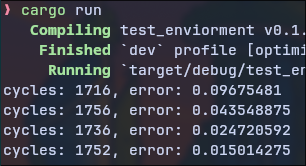

# Rust NN

A simple Neural Network library made in rust.



# usage

to use the library, import in  in your cargo file:

```toml
[dependencies]
rust_nn = { git = "https://github.com/Ukcoop/rust-NN.git" }
```

# test it out

you can see how good it performs on your mechine:

```bash
cargo run
```
